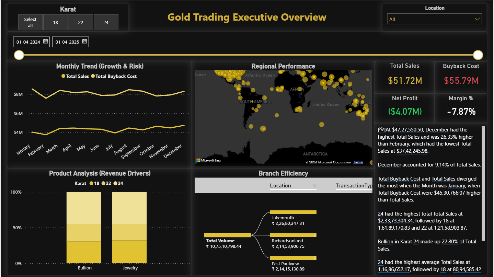

# 🏆 Synthetic Gold Trading Data Warehouse

### **Executive Summary**
This Power BI project delivers a comprehensive analysis of a synthetic gold trading business. The dashboard monitors trading volume (inflow/outflow), profit margins, and inventory velocity across 5 branch locations. It is designed to help executive management identify high-performing regions and optimize stock distribution between Jewelry (18k/22k) and Bullion (24k).

*(Note: Replace 'dashboard-main.png' with your actual filename if different)*

---

### 📂 Project Structure
* **Data/**: Raw CSV files (Transactions, Customers, Stock, etc.).
* **Gold_Trading_Dashboard.pbix**: The complete Power BI file.
* **Images/**: Screenshots of the analysis.

---

### 🛠 Tools Used
* **Power BI Desktop**: Dashboard design and visualization.
* **Power Query (M)**: ETL processing, data cleaning, and star schema modeling.
* **DAX**: Calculation of complex measures (Profit Margin %, Year-over-Year Growth).

---

### 📊 Key Performance Indicators (KPIs)
The following DAX measures were engineered to track business health:
1.  **Total Sales (Inflow)**: `CALCULATE(SUM(Transactions[TotalAmount]), Transactions[TransactionType] = "Buy")`
2.  **Total Buyback Cost (Outflow)**: Aggregation of customer returns + scrap gold purchases.
3.  **Net Profit**: `[Total Sales] - [Total Buyback Cost]`
4.  **Profit Margin %**: `DIVIDE([Net Profit], [Total Sales], 0)`

---

### 🔍 Key Insights & Analysis
1.  **Product Preference**: 
    * Analysis reveals **18k Jewelry** is the dominant revenue driver, outperforming 24k Bullion. This suggests a consumer base focused on retail fashion rather than pure investment.
2.  **Branch Efficiency**: 
    * **South Sophia** branch handles the highest transaction volume.
    * However, decomposition tree analysis warns of high "Buyback" volume in this region, potentially impacting net margins.
3.  **Regional Hotspots**: 
    * Geospatial mapping identifies **West Michellehaven** as a high-profit cluster, recommended for targeted marketing campaigns.

---

### ⚙️ Data Model (Star Schema)
The data was modeled using a classic Star Schema to ensure query performance:
* **Fact Tables**: `Transactions`, `Buybacks`
* **Dimension Tables**: `Customers`, `Branches`, `GoldItems`, `Staff`, `Pricing`
* **Relationships**: One-to-Many relationships established on ID columns.

---

### 🚀 How to Use
1.  Download the `.pbix` file from this repository.
2.  Open in **Power BI Desktop**.
3.  If prompted, update the Data Source settings to point to the CSV files in the `Data/` folder locally.

---
*Created by Ruchir Agrawal*
